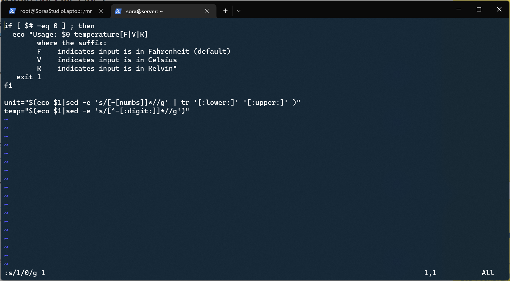

# ACIT 2420 Final Exam

Written By: Sora Schlegel

## Table of Contents

- [Part One](#part-one)

## Part One

1. Check if there are updates that have to be installed using the command: `sudo apt update`

2. To install the updates, run the command: `sudo apt upgrade`

- Note: Type `y` when prompted to install the update

3. You should also restart your kernel when prompted after the installation is complete.

## Part Two

1. Replace the "1" in the first line to a "0" using the command: `:s/1/0/g 1`

2. Replacing all "V" to "C" by using the command: `:%s/V/C/g`

3. Replacing the "numbs" to ":digit:" by using the command: `:%s/numbs/\:digit\:/g`

4. Replacing all "eco" to "echo" by using the command: `:%s/eco/echo/g`

The final result is the screen shot below.

## Part Three

1. Open the man page for the `journalctl` command by using the command: `man journalctl`

2. To find the option to display the current boot logs in the man page, use the command: `/current boot` in the man page.

3. To find the option to set the priority of the logs to be "warnings", use the command: `/priority` in the man page.

4. To find the option to format the output of the command to be a json, use the command: `/format` in the man page.

5. Combine the options and use the command `sudo journalctl -b --priority=warning --output=json-pretty`

- Note: If `sudo` is not used, then the output can only be seen by users in the group "adm" or "systemd-journal"

## Part Four

1. Add a new user by using the command: `sudo useradd -ms /bin/bash user`.

2. Set a password for the user by using the command: `passwd user`.

3. The image below shows the contents of the file `find_users`

The output of running the script

## Part 5

1. Service file contents

 

